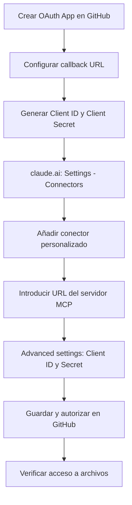

🌐 [English](README.md) | [Italiano](test.md) | [中文](README.zh.md) | [Español](README.es.md) | [हिन्दी](README.hi.md)

# Cómo configurar el servidor MCP oficial de GitHub en claude.ai (web)

## Contexto

Claude.ai web todavía no ofrece un conector nativo para GitHub, comparable a los ya disponibles para Gmail o Google Calendar. Esta carencia se señaló explícitamente en el issue [anthropics/claude-ai-mcp#98](https://github.com/anthropics/claude-ai-mcp/issues/98), que pedía un conector nativo de GitHub para usuarios no desarrolladores — y que fue **cerrado como "not planned"**.

Ante la falta de esta funcionalidad, la única forma de dar a Claude acceso en tiempo real a un repositorio (lectura y edición de archivos, issues, pull requests) es conectar manualmente el **servidor MCP oficial de GitHub** mediante un conector personalizado.

> **MCP en breve:** el Model Context Protocol es el estándar abierto que permite a Claude conectarse a herramientas y datos externos (en este caso, la API de GitHub) a través de un servidor remoto, en lugar de limitarse al contenido de la conversación.

Esta guía documenta el flujo de configuración tal como funciona en la práctica — incluyendo las diferencias respecto a lo que describe la documentación oficial.

## Requisitos previos

- Una cuenta de **GitHub** con permisos para crear una OAuth App (cuenta personal u organización con los permisos adecuados)
- Una cuenta de **claude.ai** con un plan que admita conectores personalizados (Pro, Max, Team o Enterprise)
- En los planes Team/Enterprise: rol de **Owner** para añadir el conector a nivel de organización
- Conocimiento básico del repositorio con el que se va a trabajar (nombre, propietario, rama por defecto)

## Configuración paso a paso

> **Nota:** la documentación oficial describe un flujo "solo URL" (basta con añadir la URL del servidor MCP). En la práctica, este flujo puede devolver un error **403** al intentar leer o modificar archivos. El siguiente es el camino que realmente funcionó.

1. **Crea una OAuth App en GitHub**
   Ve a `GitHub → Settings → Developer settings → OAuth Apps → New OAuth App`.

   > **OAuth App vs GitHub App:** son dos mecanismos distintos. Una *GitHub App* se instala en repositorios específicos, con permisos granulares seleccionables. Una *OAuth App* (la que se usa aquí) autoriza en cambio a nivel de toda la cuenta de usuario — no permite elegir repositorios individuales. Esta distinción es importante para la sección de permisos más adelante.

2. **Completa los campos requeridos**
   - *Homepage URL*: campo puramente informativo, mostrado a los usuarios en la pantalla de consentimiento OAuth — no afecta al funcionamiento técnico. Sirve la URL de tu organización, la del repositorio, o un placeholder como `https://github.com`
   - *Authorization callback URL*: `https://claude.ai/api/mcp/auth_callback`

3. **Genera el Client ID y el Client Secret**
   Tras crear la app, GitHub muestra el *Client ID*. Genera también un *Client Secret* desde la misma página.

   > **Si pierdes el Client Secret:** GitHub no permite recuperarlo después — hay que generar uno nuevo desde la misma página de la OAuth App y actualizarlo en "Advanced settings" del conector (paso 6).

4. **Ve a claude.ai → Settings → Connectors**
   En el menú de configuración de la cuenta, selecciona la sección "Connectors".

5. **Añade un conector personalizado**
   Haz clic en "Add custom connector" e introduce la URL del servidor MCP oficial de GitHub:
   ```
   https://api.githubcopilot.com/mcp
   ```

6. **Abre "Advanced settings"**
   Introduce el *Client ID* y el *Client Secret* generados en el paso 3.

7. **Guarda y autoriza**
   Claude redirige a GitHub a la pantalla de consentimiento OAuth: ahí se muestran los permisos solicitados (ver la sección siguiente).

8. **Verifica el acceso**
   Intenta leer o modificar un archivo de prueba. Si reaparece el error 403, comprueba que el redirect URI en la OAuth App coincide exactamente y que el Client Secret se introdujo correctamente.



## Permisos OAuth requeridos

Durante la autorización, GitHub muestra esta pantalla de permisos, **fija y no configurable**:

- Full control of codespaces
- Create gists
- Access notifications
- Full control of projects
- Read org and team membership, read org projects
- Read all user profile data
- Full control of private repositories
- Access user email addresses (read-only)
- Update GitHub Actions workflows
- Upload packages to GitHub Package Registry

> ⚠️ **Punto abierto — pendiente de solución:** estos permisos no se pueden modificar durante la autorización y son considerablemente más amplios de lo necesario para el uso previsto (leer/escribir archivos, issues, pull requests). Actualmente no hay forma de restringir el alcance directamente en este flujo OAuth. Es un problema de seguridad sin resolver: hay que identificar una solución (p. ej. una cuenta de GitHub dedicada con acceso limitado solo a los repositorios que se quieran exponer, un fine-grained personal access token con un conector personalizado alternativo, o esperar a que el servidor oficial ofrezca permisos granulares). Debe tratarse como un riesgo activo, no solo teórico, hasta que se resuelva.

## Verificar que funciona

1. **Localiza el conector en el chat**: en la ventana de conversación de claude.ai, abre el menú **"+" (Add)** — el conector de GitHub recién configurado debería aparecer en la lista de herramientas disponibles
2. **Activa/desactiva el conector**: junto al nombre del conector hay un **toggle** para activarlo o desactivarlo en la conversación actual, sin necesidad de eliminarlo de la configuración
3. En una conversación nueva (con el conector activado), pide a Claude que liste los repositorios que puede ver (p. ej. "¿qué repositorios ves?")
4. Si la lista aparece correctamente, prueba una operación de escritura sobre un archivo de prueba (p. ej. editar un archivo `test.md` en un repositorio no crítico)
5. Si obtienes un error **403**, comprueba en este orden:
   - que la redirect/callback URL en la OAuth App de GitHub coincide exactamente con la que requiere claude.ai
   - que el Client ID y el Client Secret introducidos en "Advanced settings" son correctos y no han expirado
   - que la autorización OAuth se completó realmente (pantalla de consentimiento confirmada en GitHub, no solo cerrada)

## Desconexión / Revocación de acceso

La revocación debe hacerse **en ambos lados**, de lo contrario el acceso puede quedar parcialmente activo:

1. **En claude.ai**: ve a Settings → Connectors → busca el conector de GitHub → elimínalo
2. **En GitHub**: ve a `Settings → Applications → Authorized OAuth Apps`, busca la app conectada y haz clic en "Revoke"
3. Si creaste una OAuth App dedicada (como en la configuración descrita arriba), considera eliminarla por completo desde `Settings → Developer settings → OAuth Apps`, para evitar que el Client ID/Secret sigan siendo válidos y reutilizables

> Nota: revocar solo desde el lado de claude.ai detiene el uso actual, pero no invalida el token OAuth en el lado de GitHub — para una revocación completa también hace falta el paso 2.

## Referencias

- Repositorio oficial del servidor MCP de GitHub: [github/github-mcp-server](https://github.com/github/github-mcp-server)
- Documentación oficial del Model Context Protocol: [modelcontextprotocol.io](https://modelcontextprotocol.io)
- Issue de referencia (conector nativo de GitHub, cerrado "not planned"): [anthropics/claude-ai-mcp#98](https://github.com/anthropics/claude-ai-mcp/issues/98)
- Documentación de conectores personalizados en claude.ai: [support.claude.com](https://support.claude.com)
