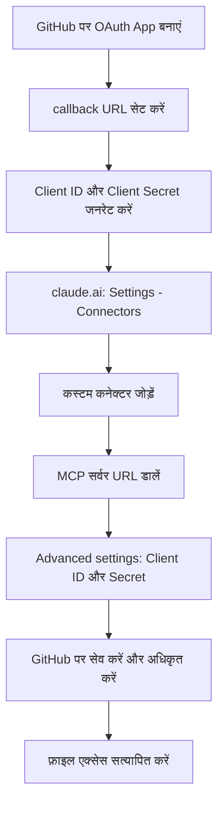

🌐 [English](README.md) | [Italiano](test.md) | [中文](README.zh.md) | [Español](README.es.md) | [हिन्दी](README.hi.md)

# claude.ai (वेब) पर आधिकारिक GitHub MCP सर्वर कैसे कॉन्फ़िगर करें

## संदर्भ

Claude.ai वेब अभी तक GitHub के लिए कोई नेटिव कनेक्टर उपलब्ध नहीं कराता, जबकि Gmail या Google Calendar के लिए यह पहले से मौजूद है। इस कमी को issue [anthropics/claude-ai-mcp#98](https://github.com/anthropics/claude-ai-mcp/issues/98) में स्पष्ट रूप से उठाया गया था, जिसमें गैर-डेवलपर उपयोगकर्ताओं के लिए एक नेटिव GitHub कनेक्टर की मांग की गई थी — लेकिन इसे **"not planned" के रूप में बंद कर दिया गया**।

इस सुविधा के अभाव में, Claude को किसी रिपॉज़िटरी तक रीयल-टाइम एक्सेस देने (फ़ाइलें, issues, pull requests पढ़ना और संपादित करना) का एकमात्र तरीका है — एक कस्टम कनेक्टर के ज़रिए **आधिकारिक GitHub MCP सर्वर** को मैन्युअल रूप से जोड़ना।

> **MCP संक्षेप में:** Model Context Protocol एक ओपन स्टैंडर्ड है जो Claude को बातचीत की सामग्री तक सीमित रहने के बजाय, एक रिमोट सर्वर के ज़रिए बाहरी टूल्स और डेटा (यहाँ GitHub API) से जुड़ने देता है।

यह गाइड सेटअप प्रक्रिया को वैसे ही दर्ज करती है जैसे वह व्यवहार में काम करती है — जिसमें आधिकारिक दस्तावेज़ में बताए गए तरीके से हुए विचलन भी शामिल हैं।

## आवश्यक शर्तें

- OAuth App बनाने की अनुमति वाला एक **GitHub** खाता (व्यक्तिगत खाता या उपयुक्त अनुमतियों वाला संगठन)
- कस्टम कनेक्टर्स को सपोर्ट करने वाला एक **claude.ai** खाता (Pro, Max, Team, या Enterprise प्लान)
- Team/Enterprise प्लान पर: संगठन स्तर पर कनेक्टर जोड़ने के लिए **Owner** भूमिका आवश्यक
- जिस रिपॉज़िटरी पर काम करना है उसकी बुनियादी जानकारी (नाम, owner, डिफ़ॉल्ट ब्रांच)

## चरण-दर-चरण सेटअप

> **नोट:** आधिकारिक दस्तावेज़ एक "केवल-URL" प्रक्रिया बताता है (बस MCP सर्वर का URL जोड़ें)। व्यवहार में, फ़ाइलें पढ़ने या संपादित करने की कोशिश करते समय यह प्रक्रिया **403** त्रुटि दे सकती है। नीचे दिया गया रास्ता वह है जो व्यवहार में वाकई काम करता है।

1. **GitHub पर एक OAuth App बनाएं**
   `GitHub → Settings → Developer settings → OAuth Apps → New OAuth App` पर जाएं।

   > **OAuth App बनाम GitHub App:** ये दोनों अलग-अलग तंत्र हैं। एक *GitHub App* विशिष्ट रिपॉज़िटरी पर इंस्टॉल होता है, जिसमें चुनने योग्य विस्तृत (granular) अनुमतियाँ होती हैं। यहाँ इस्तेमाल किया गया *OAuth App* इसके बजाय पूरे यूज़र अकाउंट के स्तर पर अनुमति देता है — यह अलग-अलग रिपॉज़िटरी चुनने की सुविधा नहीं देता। यह अंतर आगे permissions वाले सेक्शन के लिए महत्वपूर्ण है।

2. **आवश्यक फ़ील्ड भरें**
   - *Homepage URL*: यह केवल जानकारी देने वाला फ़ील्ड है, जो OAuth सहमति स्क्रीन पर उपयोगकर्ताओं को दिखाया जाता है — इसका तकनीकी कार्यप्रणाली पर कोई असर नहीं पड़ता। आपके संगठन का URL, रिपॉज़िटरी का URL, या `https://github.com` जैसा कोई placeholder भी ठीक रहेगा
   - *Authorization callback URL*: `https://claude.ai/api/mcp/auth_callback`

3. **Client ID और Client Secret जनरेट करें**
   ऐप बनाने के बाद, GitHub *Client ID* दिखाता है। उसी पेज से एक *Client Secret* भी जनरेट करें।

   > **यदि Client Secret खो जाए:** GitHub इसे बाद में दोबारा प्राप्त करने की अनुमति नहीं देता — उसी OAuth App पेज से एक नया जनरेट करना होगा और कनेक्टर की "Advanced settings" में अपडेट करना होगा (चरण 6)।

4. **claude.ai → Settings → Connectors पर जाएं**
   अकाउंट सेटिंग्स मेन्यू में "Connectors" सेक्शन चुनें।

5. **एक कस्टम कनेक्टर जोड़ें**
   "Add custom connector" पर क्लिक करें और आधिकारिक GitHub MCP सर्वर का URL डालें:
   ```
   https://api.githubcopilot.com/mcp
   ```

6. **"Advanced settings" खोलें**
   चरण 3 में जनरेट किया गया *Client ID* और *Client Secret* डालें।

7. **सेव करें और अधिकृत (authorize) करें**
   Claude आपको OAuth सहमति स्क्रीन के लिए GitHub पर रीडायरेक्ट करता है: यहीं पर अनुरोधित अनुमतियाँ दिखाई जाती हैं (देखें अगला सेक्शन)।

8. **एक्सेस सत्यापित करें**
   एक टेस्ट फ़ाइल पढ़ने या संपादित करने का प्रयास करें। यदि 403 त्रुटि फिर से दिखे, तो जांचें कि OAuth App में redirect URI बिल्कुल मेल खाता है और Client Secret सही तरीके से डाला गया है।



## आवश्यक OAuth अनुमतियाँ

अधिकृत (authorize) करते समय, GitHub यह अनुमतियों की स्क्रीन दिखाता है, जो **स्थिर और कॉन्फ़िगर नहीं की जा सकती**:

- Full control of codespaces
- Create gists
- Access notifications
- Full control of projects
- Read org and team membership, read org projects
- Read all user profile data
- Full control of private repositories
- Access user email addresses (read-only)
- Update GitHub Actions workflows
- Upload packages to GitHub Package Registry

> ⚠️ **खुला मुद्दा — समाधान की आवश्यकता:** ये अनुमतियाँ अधिकृत करते समय बदली नहीं जा सकतीं, और इच्छित उपयोग (फ़ाइलें, issues, pull requests पढ़ना/लिखना) के लिए वास्तव में जितनी ज़रूरत है उससे काफी अधिक व्यापक हैं। फ़िलहाल इस OAuth प्रक्रिया में सीधे तौर पर scope को सीमित करने का कोई तरीका मौजूद नहीं है। यह एक अनसुलझी सुरक्षा समस्या है: इसके लिए कोई समाधान खोजना ज़रूरी है (जैसे — केवल उन्हीं रिपॉज़िटरी तक सीमित एक्सेस वाला एक समर्पित GitHub अकाउंट जिन्हें एक्सपोज़ करना है, किसी वैकल्पिक कस्टम कनेक्टर के साथ fine-grained personal access token का उपयोग, या आधिकारिक सर्वर द्वारा भविष्य में granular अनुमतियों के समर्थन का इंतज़ार)। जब तक इसका समाधान नहीं हो जाता, तब तक इसे केवल सैद्धांतिक नहीं बल्कि एक सक्रिय जोखिम के रूप में देखा जाना चाहिए।

## यह काम कर रहा है या नहीं, यह जांचना

1. **चैट में कनेक्टर ढूंढें**: claude.ai की बातचीत वाली विंडो में, **"+" (Add)** मेन्यू खोलें — अभी-अभी कॉन्फ़िगर किया गया GitHub कनेक्टर उपलब्ध टूल्स की सूची में दिखना चाहिए
2. **कनेक्टर को सक्षम/अक्षम करें**: कनेक्टर के नाम के बगल में एक **टॉगल** होता है, जिससे उसे मौजूदा बातचीत के लिए सेटिंग्स से हटाए बिना ही चालू या बंद किया जा सकता है
3. एक नई बातचीत में (कनेक्टर सक्षम रहते हुए), Claude से पूछें कि वह कौन-कौन सी रिपॉज़िटरी देख पा रहा है (जैसे: "आप कौन से रिपॉज़िटरी देखते हैं?")
4. यदि सूची सही तरीके से दिखती है, तो किसी टेस्ट फ़ाइल पर एक write ऑपरेशन आज़माएं (जैसे किसी गैर-महत्वपूर्ण रिपॉज़िटरी में `test.md` फ़ाइल को संपादित करना)
5. यदि **403** त्रुटि मिले, तो इस क्रम में जांचें:
   - GitHub OAuth App में redirect/callback URL claude.ai की आवश्यकता से बिल्कुल मेल खाता है या नहीं
   - "Advanced settings" में डाले गए Client ID और Client Secret सही हैं और एक्सपायर तो नहीं हुए
   - OAuth प्राधिकरण वास्तव में पूरा हुआ है या नहीं (GitHub पर सहमति स्क्रीन की पुष्टि की गई, न कि सिर्फ़ बंद की गई)

## डिस्कनेक्ट करना / एक्सेस रद्द करना

रद्द करने की प्रक्रिया **दोनों तरफ़** से करनी होगी, अन्यथा एक्सेस आंशिक रूप से सक्रिय रह सकता है:

1. **claude.ai पर**: Settings → Connectors पर जाएं → GitHub कनेक्टर ढूंढें → उसे हटा दें
2. **GitHub पर**: `Settings → Applications → Authorized OAuth Apps` पर जाएं, जुड़ी हुई ऐप ढूंढें और "Revoke" पर क्लिक करें
3. यदि आपने एक समर्पित OAuth App बनाई थी (जैसा ऊपर वर्णित सेटअप में बताया गया है), तो इसे `Settings → Developer settings → OAuth Apps` से पूरी तरह हटाने पर विचार करें, ताकि Client ID/Secret वैध और पुनः उपयोग करने योग्य न रह जाएं

> नोट: केवल claude.ai की तरफ़ से रद्द करने पर वर्तमान उपयोग रुक जाता है, लेकिन इससे GitHub की तरफ़ का OAuth टोकन अमान्य नहीं होता — पूरी तरह रद्द करने के लिए चरण 2 भी ज़रूरी है।

## संदर्भ

- आधिकारिक GitHub MCP सर्वर रिपॉज़िटरी: [github/github-mcp-server](https://github.com/github/github-mcp-server)
- आधिकारिक Model Context Protocol दस्तावेज़: [modelcontextprotocol.io](https://modelcontextprotocol.io)
- संदर्भ issue (नेटिव GitHub कनेक्टर, "not planned" के रूप में बंद): [anthropics/claude-ai-mcp#98](https://github.com/anthropics/claude-ai-mcp/issues/98)
- claude.ai कस्टम कनेक्टर दस्तावेज़: [support.claude.com](https://support.claude.com)
