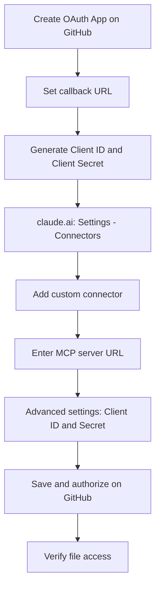

🌐 [English](README.md) | [Italiano](test.md) | [中文](README.zh.md) | [Español](README.es.md) | [हिन्दी](README.hi.md)

# How to configure the official GitHub MCP server on claude.ai (web)

## Context

Claude.ai web does not (yet) offer a native GitHub connector, comparable to the ones already available for Gmail or Google Calendar. This gap was explicitly flagged in issue [anthropics/claude-ai-mcp#98](https://github.com/anthropics/claude-ai-mcp/issues/98), which requested a native GitHub connector for non-developer users — and which was **closed as "not planned"**.

In the absence of this feature, the only way to give Claude real-time access to a repository (reading and editing files, issues, pull requests) is to manually connect the **official GitHub MCP server** via a custom connector.

> **MCP in brief:** the Model Context Protocol is the open standard that lets Claude connect to external tools and data (in this case, the GitHub API) through a remote server, instead of being limited to the content of the conversation.

This guide documents the setup flow as it actually works in practice — including deviations from what the official documentation describes.

## Prerequisites

- A **GitHub** account with permissions to create an OAuth App (personal account or organization with the appropriate permissions)
- A **claude.ai** account on a plan that supports custom connectors (Pro, Max, Team, or Enterprise)
- On Team/Enterprise plans: **Owner** role, to add the connector at the organization level
- Basic knowledge of the repository you want to work with (name, owner, default branch)

## Step-by-step setup

> **Note:** the official documentation describes a "URL-only" flow (just add the MCP server URL). In practice, this flow can return a **403** error when trying to read or edit files. The path below is the one that actually worked.

1. **Create an OAuth App on GitHub**
   Go to `GitHub → Settings → Developer settings → OAuth Apps → New OAuth App`.

   > **OAuth App vs GitHub App:** these are two different mechanisms. A *GitHub App* is installed on specific repositories, with selectable granular permissions. An *OAuth App* (the one used here) instead authorizes at the level of the entire user account — it does not allow you to pick individual repositories. This distinction matters for the permissions section further down.

2. **Fill in the required fields**
   - *Homepage URL*: a purely informational field, shown to users on the OAuth consent screen — it has no effect on how things actually work. Your organization's URL, the repository's URL, or a placeholder like `https://github.com` all work fine
   - *Authorization callback URL*: `https://claude.ai/api/mcp/auth_callback`

3. **Generate a Client ID and Client Secret**
   After creating the app, GitHub shows the *Client ID*. Also generate a *Client Secret* from the same page.

   > **If you lose the Client Secret:** GitHub does not let you retrieve it afterwards — you need to generate a new one from the same OAuth App page and update it in the connector's "Advanced settings" (step 6).

4. **Go to claude.ai → Settings → Connectors**
   In the account settings menu, select the "Connectors" section.

5. **Add a custom connector**
   Click "Add custom connector" and enter the URL of the official GitHub MCP server:
   ```
   https://api.githubcopilot.com/mcp
   ```

6. **Open "Advanced settings"**
   Enter the *Client ID* and *Client Secret* generated in step 3.

7. **Save and authorize**
   Claude redirects to GitHub for the OAuth consent screen: this is where the requested permissions are shown (see the next section).

8. **Verify access**
   Try reading or editing a test file. If the 403 error reappears, check that the redirect URI in the OAuth App matches exactly, and that the Client Secret was entered correctly.



## Required OAuth permissions

During authorization, GitHub shows this permissions screen, **fixed and not configurable**:

- Full control of codespaces
- Create gists
- Access notifications
- Full control of projects
- Read org and team membership, read org projects
- Read all user profile data
- Full control of private repositories
- Access user email addresses (read-only)
- Update GitHub Actions workflows
- Upload packages to GitHub Package Registry

> ⚠️ **Open issue — needs a solution:** these permissions cannot be modified during authorization and are significantly broader than what's actually needed for the intended use (reading/writing files, issues, pull requests). There is currently no way to restrict the scope directly within this OAuth flow. This is an unresolved security problem: a solution needs to be identified (e.g. a dedicated GitHub account with access limited to only the repositories to be exposed, a fine-grained personal access token with an alternative custom connector, or waiting for the official server to eventually support granular permissions). It should be treated as an active risk, not just a theoretical one, until it's resolved.

## Verifying it works

1. **Find the connector in chat**: in the conversation window on claude.ai, open the **"+" (Add)** menu — the GitHub connector you just configured should appear in the list of available tools
2. **Enable/disable the connector**: next to the connector's name there is a **toggle** to turn it on or off for the current conversation, without having to remove it from settings
3. In a new conversation (with the connector enabled), ask Claude to list the repositories it can see (e.g. "which repositories do you see?")
4. If the list shows up correctly, try a write operation on a test file (e.g. editing a `test.md` file in a non-critical repository)
5. If you get a **403** error, check in this order:
   - that the redirect/callback URL in the GitHub OAuth App matches exactly what claude.ai requires
   - that the Client ID and Client Secret entered in "Advanced settings" are correct and not expired
   - that the OAuth authorization was actually completed (consent screen confirmed on GitHub, not just closed)

## Disconnecting / Revoking access

Revocation needs to happen **on both sides**, otherwise access can remain partially active:

1. **On claude.ai**: go to Settings → Connectors → find the GitHub connector → remove it
2. **On GitHub**: go to `Settings → Applications → Authorized OAuth Apps`, find the connected app and click "Revoke"
3. If you created a dedicated OAuth App (as in the setup described above), consider deleting it entirely from `Settings → Developer settings → OAuth Apps`, to avoid the Client ID/Secret remaining valid and reusable

> Note: revoking only on the claude.ai side stops current usage, but does not invalidate the OAuth token on GitHub's side — a full revocation also requires step 2.

## References

- Official GitHub MCP server repository: [github/github-mcp-server](https://github.com/github/github-mcp-server)
- Official Model Context Protocol documentation: [modelcontextprotocol.io](https://modelcontextprotocol.io)
- Reference issue (native GitHub connector, closed "not planned"): [anthropics/claude-ai-mcp#98](https://github.com/anthropics/claude-ai-mcp/issues/98)
- claude.ai custom connector documentation: [support.claude.com](https://support.claude.com)
