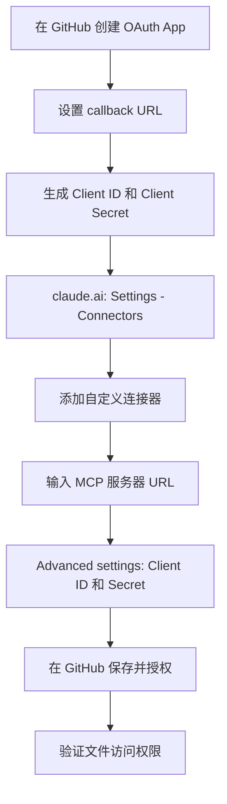

🌐 [English](README.md) | [Italiano](test.md) | [中文](README.zh.md) | [Español](README.es.md) | [हिन्दी](README.hi.md)

# 如何在 claude.ai（网页版）上配置官方 GitHub MCP 服务器

## 背景

Claude.ai 网页版目前还没有提供原生的 GitHub 连接器，不像 Gmail 或 Google Calendar 那样已经有原生连接器。这一缺口在 issue [anthropics/claude-ai-mcp#98](https://github.com/anthropics/claude-ai-mcp/issues/98) 中被明确提出——该 issue 请求为非开发者用户提供原生 GitHub 连接器——但最终被**标记为 "not planned" 并关闭**。

在这一功能缺失的情况下，唯一能让 Claude 实时访问某个仓库（读取和编辑文件、issue、pull request）的方法，就是通过自定义连接器手动接入**官方 GitHub MCP 服务器**。

> **MCP 简介：** Model Context Protocol（模型上下文协议）是一个开放标准，允许 Claude 通过远程服务器连接到外部工具和数据（本例中是 GitHub API），而不是仅限于对话内容本身。

本指南记录的是实际操作中真正可行的配置流程——包括与官方文档描述不一致的地方。

## 前置条件

- 一个拥有创建 OAuth App 权限的 **GitHub** 账号（个人账号或拥有相应权限的组织账号）
- 一个支持自定义连接器的 **claude.ai** 账号（Pro、Max、Team 或 Enterprise 套餐）
- 在 Team/Enterprise 套餐下：需要 **Owner** 角色才能在组织层面添加连接器
- 对目标仓库的基本了解（名称、所有者、默认分支）

## 分步设置

> **注意：** 官方文档描述的是一个"仅需 URL"的流程（只需添加 MCP 服务器的 URL）。但实际操作中，这个流程在读取或修改文件时可能会返回 **403** 错误。以下是实际验证可行的路径。

1. **在 GitHub 上创建一个 OAuth App**
   前往 `GitHub → Settings → Developer settings → OAuth Apps → New OAuth App`。

   > **OAuth App 与 GitHub App 的区别：** 这是两种不同的机制。*GitHub App* 安装在特定仓库上，可以选择细粒度的权限。而这里使用的 *OAuth App* 则是在整个用户账号层面进行授权——无法选择单个仓库。这个区别对下文的权限部分很重要。

2. **填写所需字段**
   - *Homepage URL*：纯信息性字段，会显示在 OAuth 授权同意页面上——不影响实际功能。可以填写你的组织网址、仓库网址，或类似 `https://github.com` 的占位符
   - *Authorization callback URL*：`https://claude.ai/api/mcp/auth_callback`

3. **生成 Client ID 和 Client Secret**
   创建应用后，GitHub 会显示 *Client ID*。同一页面上还需生成一个 *Client Secret*。

   > **如果丢失了 Client Secret：** GitHub 不允许事后找回——需要在同一个 OAuth App 页面重新生成一个，并更新到连接器的 "Advanced settings" 中（第 6 步）。

4. **前往 claude.ai → Settings → Connectors**
   在账号设置菜单中选择 "Connectors" 部分。

5. **添加自定义连接器**
   点击 "Add custom connector"，输入官方 GitHub MCP 服务器的 URL：
   ```
   https://api.githubcopilot.com/mcp
   ```

6. **打开 "Advanced settings"**
   输入第 3 步生成的 *Client ID* 和 *Client Secret*。

7. **保存并授权**
   Claude 会跳转到 GitHub 的 OAuth 授权同意页面：此处会显示所请求的权限（见下一节）。

8. **验证访问权限**
   尝试读取或修改一个测试文件。如果再次出现 403 错误，请检查 OAuth App 中的 redirect URI 是否完全匹配，以及 Client Secret 是否输入正确。



## 所需的 OAuth 权限

在授权过程中，GitHub 会显示以下权限列表，**固定且不可配置**：

- Full control of codespaces
- Create gists
- Access notifications
- Full control of projects
- Read org and team membership, read org projects
- Read all user profile data
- Full control of private repositories
- Access user email addresses (read-only)
- Update GitHub Actions workflows
- Upload packages to GitHub Package Registry

> ⚠️ **待解决问题：** 这些权限在授权时无法修改，且明显超出了实际用途（读写文件、issue、pull request）所需的范围。目前没有办法在此 OAuth 流程中直接限制权限范围。这是一个尚未解决的安全问题：需要找到解决方案（例如使用一个仅授予需要暴露的仓库访问权限的专用 GitHub 账号、使用细粒度个人访问令牌（fine-grained personal access token）搭配替代的自定义连接器，或等待官方服务器未来支持细粒度权限）。在问题解决之前，应将其视为一个现实存在的风险，而非仅仅是理论上的风险。

## 验证是否生效

1. **在聊天中找到连接器**：在 claude.ai 的对话窗口中，打开 **"+"（添加）**菜单——刚配置好的 GitHub 连接器应该会出现在可用工具列表中
2. **启用/禁用连接器**：连接器名称旁边有一个**开关（toggle）**，可以为当前对话单独启用或禁用它，而无需从设置中彻底移除
3. 在新对话中（并已启用该连接器），让 Claude 列出它能看到的仓库（例如："你能看到哪些仓库？"）
4. 如果列表正常显示，尝试对一个测试文件执行写操作（例如修改某个非关键仓库中的 `test.md` 文件）
5. 如果收到 **403** 错误，请按以下顺序检查：
   - GitHub OAuth App 中的 redirect/callback URL 是否与 claude.ai 要求的完全一致
   - "Advanced settings" 中输入的 Client ID 和 Client Secret 是否正确且未过期
   - OAuth 授权流程是否真正完成（在 GitHub 上确认了授权同意页面，而不是只是关闭了它）

## 断开连接 / 撤销访问权限

撤销操作需要**在两端同时进行**，否则访问权限可能仍部分保留有效：

1. **在 claude.ai 上**：前往 Settings → Connectors → 找到 GitHub 连接器 → 移除它
2. **在 GitHub 上**：前往 `Settings → Applications → Authorized OAuth Apps`，找到已连接的应用并点击 "Revoke"
3. 如果你创建了专用的 OAuth App（如上文设置流程所述），可以考虑从 `Settings → Developer settings → OAuth Apps` 中彻底删除它，以避免 Client ID/Secret 继续有效并可被重复使用

> 注意：仅在 claude.ai 一侧撤销，只会停止当前的使用，但不会使 GitHub 一侧的 OAuth 令牌失效——要彻底撤销，还需要完成第 2 步。

## 参考资料

- 官方 GitHub MCP 服务器仓库：[github/github-mcp-server](https://github.com/github/github-mcp-server)
- 官方 Model Context Protocol 文档：[modelcontextprotocol.io](https://modelcontextprotocol.io)
- 参考 issue（原生 GitHub 连接器请求，已标记 "not planned" 关闭）：[anthropics/claude-ai-mcp#98](https://github.com/anthropics/claude-ai-mcp/issues/98)
- claude.ai 自定义连接器文档：[support.claude.com](https://support.claude.com)
