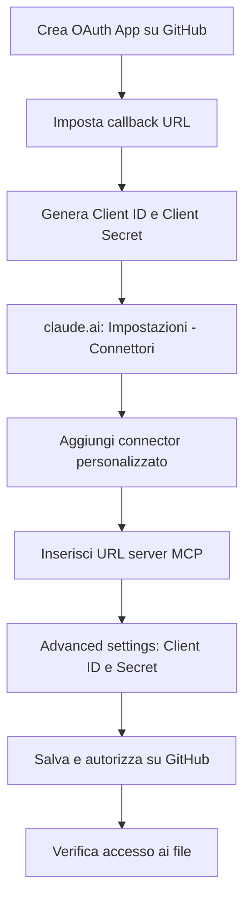

# Come configurare il server MCP ufficiale di GitHub su claude.ai (web)

## Contesto

Claude.ai web non offre (ancora) un connector nativo per GitHub, paragonabile a quelli già disponibili per Gmail o Google Calendar. Questo gap è stato segnalato esplicitamente nella issue [anthropics/claude-ai-mcp#98](https://github.com/anthropics/claude-ai-mcp/issues/98), che chiedeva un connector GitHub nativo per utenti non-developer — e che è stata **chiusa come "not planned"**.

In assenza di questa funzionalità, l'unico modo per dare a Claude accesso in tempo reale a un repository (lettura e modifica file, issue, pull request) è collegare manualmente il **server MCP ufficiale di GitHub** tramite un custom connector.

> **MCP in breve:** il Model Context Protocol è lo standard aperto che permette a Claude di collegarsi a strumenti e dati esterni (in questo caso, l'API di GitHub) tramite un server remoto, invece di limitarsi al contenuto della conversazione.

Questa guida documenta il flusso di setup così come si presenta nella pratica — incluse le deviazioni rispetto a quanto descritto nella documentazione ufficiale.

## Prerequisiti

- Un account **GitHub** con permessi per creare OAuth App (account personale o organizzazione con i permessi adeguati)
- Un account **claude.ai** con piano che supporta i custom connector (Pro, Max, Team o Enterprise)
- Sui piani Team/Enterprise: ruolo di **Owner** per aggiungere il connector a livello di organizzazione
- Conoscenza base del repository su cui si vuole operare (nome, owner, branch di default)

## Setup passo-passo

> **Nota:** la documentazione ufficiale descrive un flusso "solo URL" (aggiungi l'URL del server MCP e basta). Nella pratica, questo flusso può restituire un errore **403** al momento di leggere o modificare i file. Il percorso seguente è quello che ha funzionato concretamente.

1. **Crea una OAuth App su GitHub**
   Vai su `GitHub → Settings → Developer settings → OAuth Apps → New OAuth App`.

   > **OAuth App vs GitHub App:** sono due meccanismi diversi. Una *GitHub App* si installa su repository specifici, con permessi granulari selezionabili. Una *OAuth App* (quella usata qui) autorizza invece a livello di intero account utente — non permette di scegliere singoli repository. Questa distinzione è importante per la sezione sui permessi più avanti.

2. **Compila i campi richiesti**
   - *Homepage URL*: campo puramente informativo, mostrato agli utenti nella schermata di consenso OAuth — non incide sul funzionamento tecnico. Va bene l'URL della tua organizzazione, del repository, o un placeholder come `https://github.com`
   - *Authorization callback URL*: `https://claude.ai/api/mcp/auth_callback`

3. **Genera Client ID e Client Secret**
   Dopo la creazione dell'app, GitHub mostra il *Client ID*. Genera anche un *Client Secret* dalla stessa pagina.

   > **Se perdi il Client Secret:** GitHub non permette di recuperarlo in un secondo momento — va generato uno nuovo dalla stessa pagina dell'OAuth App e aggiornato nelle "Advanced settings" del connector (passo 6).

4. **Vai su claude.ai → Impostazioni → Connettori**
   Nel menu delle impostazioni dell'account, seleziona la sezione "Connettori".

5. **Aggiungi un connector personalizzato**
   Clicca su "Aggiungi connector personalizzato" e inserisci l'URL del server MCP ufficiale di GitHub:
   ```
   https://api.githubcopilot.com/mcp
   ```

6. **Apri "Advanced settings"**
   Inserisci il *Client ID* e il *Client Secret* generati al passo 3.

7. **Salva e autorizza**
   Claude reindirizza a GitHub per la schermata di consenso OAuth: qui vengono mostrati i permessi richiesti (vedi sezione successiva).

8. **Verifica l'accesso**
   Prova a leggere o modificare un file di test. Se ricompare l'errore 403, controlla che il redirect URI nell'OAuth App corrisponda esattamente e che il Client Secret sia stato inserito correttamente.



## Permessi OAuth richiesti

Durante l'autorizzazione, GitHub mostra questa schermata di permessi, **fissa e non configurabile**:

- Full control of codespaces
- Create gists
- Access notifications
- Full control of projects
- Read org and team membership, read org projects
- Read all user profile data
- Full control of private repositories
- Access user email addresses (read-only)
- Update GitHub Actions workflows
- Upload packages to GitHub Package Registry

> ⚠️ **Punto aperto — da risolvere:** questi permessi non sono modificabili in fase di autorizzazione e sono significativamente più ampi di quanto necessario per il solo utilizzo previsto (lettura/scrittura file, issue, pull request). Non esiste, ad oggi, un modo per restringere lo scope direttamente in questo flusso OAuth. Questo è un problema di sicurezza non ancora risolto: va identificata una soluzione (es. account GitHub dedicato con accesso limitato ai soli repository da esporre, fine-grained personal access token con connector custom alternativo, o attesa di un eventuale supporto a permessi granulari da parte del server ufficiale). Va trattato come un rischio attivo, non solo teorico, finché non viene risolto.

## Verifica funzionamento

1. **Individua il connector nella chat**: nella finestra di conversazione su claude.ai, apri il menù **"+" (Aggiungi)** — da lì il connector GitHub appena configurato dovrebbe comparire nell'elenco degli strumenti disponibili
2. **Abilita/disabilita il connector**: accanto al nome del connector è presente un **toggle** che permette di attivarlo o disattivarlo per la conversazione corrente, senza doverlo rimuovere dalle impostazioni
3. In una nuova conversazione (con il connector attivato), chiedi a Claude di elencare i repository visibili (es. "quali repository vedi?")
4. Se la lista compare correttamente, prova un'operazione di scrittura su un file di test (es. modifica di un file `test.md` in un repository non critico)
5. Se ricevi un errore **403**, verifica in ordine:
   - che il redirect/callback URL nell'OAuth App su GitHub corrisponda esattamente a quello richiesto da claude.ai
   - che Client ID e Client Secret inseriti in "Advanced settings" siano corretti e non scaduti
   - che l'autorizzazione OAuth sia stata effettivamente completata (schermata di consenso confermata su GitHub, non solo chiusa)

## Disconnessione / Revoca accesso

La revoca va fatta **su entrambi i lati**, altrimenti l'accesso può restare parzialmente attivo:

1. **Su claude.ai**: vai su Impostazioni → Connettori → trova il connector GitHub → rimuovilo
2. **Su GitHub**: vai su `Settings → Applications → Authorized OAuth Apps`, trova l'app collegata e clicca "Revoke"
3. Se hai creato una OAuth App dedicata (come nel setup descritto sopra), valuta se eliminarla del tutto da `Settings → Developer settings → OAuth Apps`, per evitare che Client ID/Secret restino validi e riutilizzabili

> Nota: revocare solo dal lato claude.ai interrompe l'uso corrente, ma non invalida il token OAuth lato GitHub — per una revoca completa serve anche il passaggio 2.

## Riferimenti

- Repository ufficiale del server MCP GitHub: [github/github-mcp-server](https://github.com/github/github-mcp-server)
- Documentazione ufficiale Model Context Protocol: [modelcontextprotocol.io](https://modelcontextprotocol.io)
- Issue di riferimento (connector nativo GitHub, chiusa "not planned"): [anthropics/claude-ai-mcp#98](https://github.com/anthropics/claude-ai-mcp/issues/98)
- Documentazione custom connector su claude.ai: [support.claude.com](https://support.claude.com)
